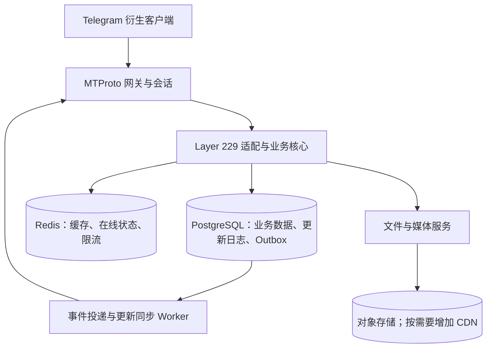

# 架构与数据流

本文档描述 Teamgram Server 的服务拓扑、请求路径及与 MTProto/API 的对应关系。更详细的端口表与 Mermaid 图见 [服务拓扑与配置](../docs/service-topology-zh.md)。

## 架构图

项目 README 中的整体架构图：

## 服务列表与职责

| 服务 | 默认 RPC 端口 | 对客户端暴露（示例） | 职责 |
|------|----------------|----------------------|------|
| **gnetway** | 20110 | 10443 (TCP MTProto)、11443 (WebSocket)、5222 (TCP) | 协议网关：接收客户端 MTProto，转发到 session |
| **session** | 20120 | — | 会话层：连接状态、鉴权、将 RPC 路由到 BFF |
| **bff** | 20010 | — | 聚合层：MTProto RPC 转后端 gRPC |
| **authsession** | 20450 | — | 鉴权会话：登录态、会话校验 |
| **biz** | 20020 | — | 业务核心：用户、聊天、对话、消息、更新等 gRPC |
| **msg** | 20030 | — | 消息服务：存储、投递、inbox |
| **sync** | 20420 | — | 同步：多端更新 |
| **dfs** | 20640 | 11701 (HTTP 可选) | 分布式文件：上传/下载路由与存储 |
| **media** | 20650 | — | 媒体：图片/文档/视频元数据与处理 |
| **idgen** | 20660 | — | 分布式 ID 生成 |
| **status** | 20670 | — | 用户在线状态 |
| **httpserver** | 8801 | 8801 (HTTP) | 可选：HTTP API 或 Web 回调 |

发现与配置通过 **etcd**；配置文件在 `teamgramd/etc/`（Docker 可用 `teamgramd/etc2/`）。启动顺序见 `teamgramd/bin/runall2.sh` 或 `teamgramd/bin/runall-docker.sh`。

## 请求路径（概要）

客户端 → gnetway (MTProto) → session → BFF → biz / msg / dfs / media / sync；消息与事件经 Kafka。

## 数据与存储

| 组件 | 用途 |
|------|------|
| **PostgreSQL 18** | 独立实现的唯一生产业务数据存储；所有新部署先执行 PostgreSQL 初始化与迁移脚本 |
| **MySQL** | 仅保留在 Teamgram 迁移边界和隔离历史测试中；不属于生产运行时 |
| **Redis** | 缓存、会话、去重 |
| **Kafka** | 消息与事件管道（msg、sync、inbox） |
| **MinIO** | 对象存储：桶 `documents`、`encryptedfiles`、`photos`、`videos` |
| **etcd** | 服务发现与配置 |

## 端口与配置

- 对客户端暴露的端口以 **gnetway** 为准（默认 10443、11443、5222）。其余为内部 RPC/HTTP。
- YAML 配置：`teamgramd/etc/` 或 `teamgramd/etc2/`；二进制：`make` → `teamgramd/bin/`。

## 演进决策与目标边界

本项目采用渐进完善和按模块替换的路线，不以从零重写整个后端作为默认方案。保留现有 Go 技术栈、Teamgram MTProto 基础和 Layer 229 公共合约；补齐客户端功能、完成 PostgreSQL 迁移及上线验收后，再逐步脱离 Teamgram 依赖。只有兼容性证据和测量结果证明某个模块难以继续修复或满足要求时，才评估重写该模块。

目标是在明确用户地区、网络条件和业务负载下，让消息体验接近 Telegram。Telegram 完整服务端未开源；同等全球容量还需要网络布局、存储扩展和长期运维能力。数据库选型、接口数量或服务数量均不能单独证明性能相当。

上文描述现有拓扑。以下为 PostgreSQL 单库生产路径的职责划分与验收目标。迁移未通过验收的服务必须阻止生产启动，不能通过隐式 MySQL 回退掩盖缺口。

## 目标逻辑架构与轻量部署

- **业务模块**：用户、权限、聊天、消息、对话列表及更新有明确状态所有者和内部契约。保持一个权威写入路径，避免不同客户端或 BFF 路径分别实现同一业务规则。
- **部署边界**：网关/会话按长连接与加密负载扩容，同步 Worker 按投递积压扩容，媒体服务按带宽与计算负载扩容。其他模块是否独立部署，以串行 RPC 成本、资源使用和故障隔离需要决定。
- **轻量化**：先减少重复查询、重复序列化和串行调用。保留现有 Kafka、etcd 等过渡依赖；其替换遵循独立化阶段的验收条件，新增中间件须有具体容量或可靠性需求。
- **接入与会话**：明确连接/会话归属、节点路由、断线重连和节点退出后的恢复路径。对外开放协议网关和必要的受控媒体入口，内部 RPC 与基础设施使用内部网络。

## 消息一致性与更新恢复

1. 成功确认前，在负责该状态的事务中提交权威消息/状态、对应更新记录和可恢复的投递意图。事务中不等待全体成员推送或外部媒体/provider 调用。
2. 复用并完善 Outbox 原则。Worker 至少一次投递，接收方通过方法规定范围内的唯一约束、幂等映射和更新游标处理重复；跨服务投递在接收方自己的事务中完成，避免假设数据库与消息队列天然原子提交。
3. 实时推送与 `updates.getDifference`、`updates.getChannelDifference` 使用一致的权威更新数据。推送失败、节点重启或客户端离线后，仍可补齐更新；过期更新按协议执行状态重同步。
4. 实体 ID、消息 ID、用户 `pts`、频道 `pts`、加密更新 `qts` 和会话 `seq` 各自遵守协议作用域与 TL 类型，`date` 与对应更新保持一致。普通数据库 sequence、全局 Snowflake ID 或仅存于 Redis 的计数器不能直接替代这些更新状态。
5. 将多设备、相同 `random_id` 重试、并发修改、乱序/重复更新、编辑删除、成员权限变化和进程重启列为重点验收场景。消息与必要更新的持久性不能依赖可被清空的缓存。

## 投递规模与待测量路径

私聊和基本群可维护用户收件箱。频道/超级群按其消息 ID、权限和历史可见性语义采用共享历史与更新流，配合后台批量通知和差分补齐。大型频道应避免为每位订阅者复制完整消息；异步投递仍须保留成员变更、权限检查和更新顺序。

当前源码中以下路径值得优先测量，尚不能将其列为经过压测确认的瓶颈：

| 当前实现 | 需要验证的问题 |
|----------|----------------|
| [基本群发送等待逐成员收件箱调用](../app/messenger/msg/msg/internal/core/msg.sendMessageV2_handler.go) | 成员数、下游延迟及部分失败对发送响应的影响 |
| [频道消息事务创建全部成员的投递记录](../app/bff/apifull/internal/domain/channel_delivery_outbox.go) | 大频道的事务耗时、写入量、锁等待及重试成本 |

## PostgreSQL 数据访问与扩展

- 建议建立项目本地的 PostgreSQL 数据访问层，基于 `pgx` 统一事务、连接池与错误映射。该建议不代表驱动迁移已完成。
- 消息历史按客户端的 `offset_id`、日期、方向和稳定排序语义使用索引定位与游标查询，避免深层 OFFSET 扫描。用户/会话/频道等查询建立与访问条件匹配的联合索引，查询关键字段使用结构化列。
- 先采用单主库；刚写入的消息、权限和关键实时状态从主库读取，容忍延迟的查询再评估只读副本。使用 `pgxpool` 控制所有实例的连接总预算；多实例连接需求增长后再评估 PgBouncer。
- 保持事务短小，固定锁顺序，并设置合理的查询、锁等待及事务超时。通过执行计划、慢查询、锁等待、连接池等待和表增长评估索引、分区与跨库分片需求。
- 设计备份、WAL/PITR 恢复和主库故障恢复，明确不同故障范围的 RPO（可接受数据损失）与 RTO（恢复时间）。异步副本可能丢失尚未复制的已提交数据；如要求主库故障时 RPO 为零，须评估同步复制及其确认延迟。

## 媒体、通话与客户端体验

文件内容存于对象存储，数据库保存权威元数据。缩略图、转码和扫描使用有并发上限的后台任务，并隔离 CPU、内存、队列和带宽预算。CDN 按用户地区与流量引入，上传下载仍须满足标准 MTProto 文件方法、鉴权和文件位置语义。

通话需要与支持客户端匹配的信令、媒体传输、TURN/中继和群通话 SFU。只有 `phone.*` 方法或媒体 provider 接口不构成通话可用；须在真实客户端验证接通、双向音视频、重连及结束后的资源释放。

感知速度还受客户端本地缓存、待发送消息展示、弱网重连和缩略图加载影响，验收应同时测量服务端处理与客户端端到端体验。

## 功能与性能验收

功能状态与证据沿用唯一的 [Layer 229 方法台账](../LAYER229_METHOD_LEDGER.csv)。按[协议与兼容性](protocol-and-compatibility-zh.md)将客户端功能映射到方法、权限、持久化和更新恢复场景。正确 constructor、编译通过或单会话成功均不能替代完整功能验收。

以下是**初始设计预算**，不是已测结果，也不是 Telegram 官方指标。只有在确定负载模型后才可将其作为该场景的验收门槛：

| 指标 | 初始预算 | 测量边界 |
|------|----------|----------|
| 普通文本发送的服务端处理 | P95 ≤ 50 ms | 网关收到完整请求至生成成功 RPC 结果，包含内部排队、路由和持久化，不含公网 RTT |
| 同地区、连接已建立的双方消息到达 | P95 ≤ 300 ms | 发送端提交至接收端解码对应更新，记录网络 RTT，客户端待发送展示不计作到达 |
| 常规一页消息历史的服务端处理 | P95 ≤ 100 ms | 网关收到完整请求至生成响应，明确页大小、数据规模、缓存冷热状态 |
| 已确认消息与更新的故障恢复 | 在约定故障范围内完整恢复 | 明确进程退出、Worker 中断、主库故障等故障模型及对应 RPO/RTO |

压测前固定同时在线数、活跃发送比例、每秒消息量、连接建立速率、群/频道成员分布、广播速率、媒体并发量、历史数据规模、地区/RTT、硬件与副本配置。分别报告私聊、基本群、频道、媒体及断线恢复场景的吞吐、P50/P95/P99、CPU/内存、数据库写入与锁等待、队列积压和追赶时间，避免用平均延迟或空载结果宣称性能相当。

实施顺序与阶段出口见[路线图](roadmap-zh.md)，上线条件见[版本与发布](release-and-changelog-zh.md)。
