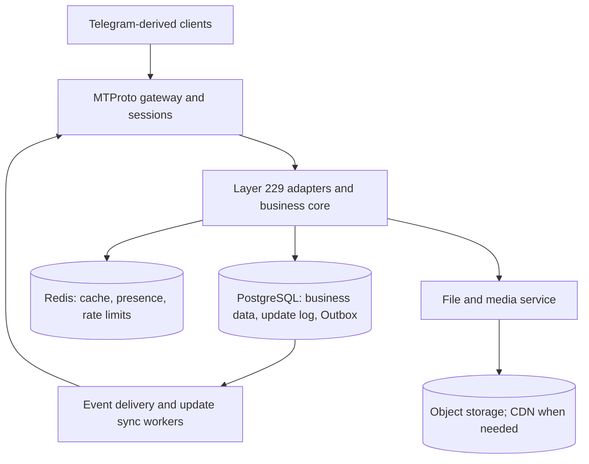

# Architecture and data flow

This document describes Teamgram Server’s service topology, request path, and how it maps to MTProto/API. For a detailed port table and Mermaid diagram, see [Service topology and configuration](../docs/service-topology.md).

## Architecture diagram

High-level diagram in the project README:

## Service list and roles

| Service | Default RPC port | Client-facing (example) | Role |
|---------|------------------|--------------------------|------|
| **gnetway** | 20110 | 10443 (TCP MTProto), 11443 (WebSocket), 5222 (TCP) | Protocol gateway: accepts client MTProto (TCP/WebSocket), forwards to session |
| **session** | 20120 | — | Session layer: connection state, auth, routes RPC to BFF |
| **bff** | 20010 | — | Backend-for-frontend: MTProto RPC → backend gRPC calls |
| **authsession** | 20450 | — | Auth session: login state, session validation |
| **biz** | 20020 | — | Core business: user, chat, dialog, message, updates gRPC |
| **msg** | 20030 | — | Message service: storage, delivery, inbox |
| **sync** | 20420 | — | Sync: multi-device updates |
| **dfs** | 20640 | 11701 (HTTP optional) | Distributed file: upload/download routing, storage |
| **media** | 20650 | — | Media: image/document/video metadata and processing |
| **idgen** | 20660 | — | Distributed ID generation |
| **status** | 20670 | — | User online status |
| **httpserver** | 8801 | 8801 (HTTP) | Optional: HTTP API or web callbacks |

Discovery is via **etcd**; config files live under `teamgramd/etc/` (or `teamgramd/etc2/` for Docker). Startup order: see `teamgramd/bin/runall2.sh` or `teamgramd/bin/runall-docker.sh`.

## Request path (summary)

Client → gnetway (MTProto) → session → BFF → biz / msg / dfs / media / sync; messaging and events use Kafka.

## Data and storage

| Component | Purpose |
|-----------|---------|
| **PostgreSQL 18** | Sole production business data store for the independent implementation; initialize it on every new deployment |
| **MySQL** | Kept only behind the Teamgram migration boundary and isolated legacy tests; never a production runtime |
| **Redis** | Cache, session, deduplication |
| **Kafka** | Message and event pipeline (msg, sync, inbox) |
| **MinIO** | Object storage: buckets `documents`, `encryptedfiles`, `photos`, `videos` |
| **etcd** | Service discovery and config |

## Ports and config

- Client-facing ports are those exposed by **gnetway** (default 10443, 11443, 5222). Other ports are internal RPC/HTTP.
- YAML configs: `teamgramd/etc/` (or `teamgramd/etc2/` for Docker). Binaries: `make` → `teamgramd/bin/`.

## Evolution decision and target boundaries

Evolve the backend incrementally and replace modules where justified; a rewrite of the entire backend from zero is not the default. Retain the current Go stack, Teamgram MTProto foundation, and public Layer 229 contract. Complete required client functionality, the PostgreSQL port, and production acceptance before gradually removing Teamgram dependencies. Consider rewriting a module only when compatibility evidence and measurements show that continued repair cannot meet requirements.

The goal is a messaging experience close to Telegram under a defined user geography, network, and workload. Telegram's complete backend is not open source; matching its global capacity also requires network deployment, storage scaling, and sustained operations. Database choice, handler count, or service count alone cannot establish equivalent performance.

The sections above describe the existing topology. The following logical responsibilities and acceptance targets define the PostgreSQL-only production path. A service whose port is not accepted must fail startup instead of silently falling back to MySQL.

## Target logical architecture and lightweight deployment

- **Business modules**: Give users, permissions, chats, messages, dialogs, and updates clear state ownership and internal contracts. Maintain one authoritative mutation path instead of separate business rules for different clients or BFF routes.
- **Deployment boundaries**: Scale gateways/sessions for connection and encryption load, sync workers for delivery lag, and media services for bandwidth and compute. Decide whether other modules need separate deployment from serial RPC cost, resource use, and failure isolation needs.
- **Lightweight operation**: First reduce repeated queries, serialization, and serial calls. Retain Kafka, etcd, and other transitional dependencies; replacements follow the independence acceptance gates. Introduce additional middleware only for a concrete capacity or reliability requirement.
- **Ingress and sessions**: Define connection/session ownership, node routing, reconnection, and recovery after node exit. Expose protocol gateways and necessary controlled media endpoints; keep internal RPC and infrastructure on internal networks.

## Message consistency and update recovery

1. Before acknowledging success, commit authoritative messages/state, corresponding update records, and recoverable delivery intent in the transaction that owns that state. Do not wait for delivery to every member or external media/provider calls inside it.
2. Reuse and complete the Outbox approach. Workers deliver at least once; recipients handle duplicates through unique constraints in the scope required by the method, idempotency mappings, and update cursors. Cross-service delivery commits in the recipient's own transaction; do not assume database and queue writes are inherently atomic.
3. Real-time push, `updates.getDifference`, and `updates.getChannelDifference` use consistent authoritative update data. Recover after failed push, node restarts, and offline clients; handle expired update history through protocol-defined state resynchronization.
4. Entity IDs, message IDs, user `pts`, channel `pts`, encrypted-update `qts`, and session `seq` retain their protocol scopes and TL types; `date` remains consistent with the corresponding updates. Ordinary database sequences, global Snowflake IDs, or counters held only in Redis cannot directly replace update state.
5. Prioritize acceptance for multiple devices, repeated `random_id`, concurrent mutations, reordered/duplicate updates, edits/deletes, membership permission changes, and process restarts. Message and required update durability must not depend on a cache that can be cleared.

## Delivery scale and paths to measure

Private chats and basic groups can maintain user inboxes. Channels/megagroups use shared history and update streams according to their message ID, permission, and history visibility semantics, with batched background notification and difference recovery. Large channels should avoid copying complete messages to every subscriber; asynchronous delivery must still preserve membership changes, authorization, and update ordering.

Prioritize measurement of these current source paths. They are candidates for investigation, not bottlenecks confirmed by load tests:

| Current implementation | Question to verify |
|------------------------|--------------------|
| [Basic-group sends wait for per-member inbox calls](../app/messenger/msg/msg/internal/core/msg.sendMessageV2_handler.go) | Effect of member count, downstream latency, and partial failures on send responses |
| [Channel message transactions create delivery records for all members](../app/bff/apifull/internal/domain/channel_delivery_outbox.go) | Transaction duration, write volume, lock waits, and retry cost for large channels |

## PostgreSQL access and scaling

- Prefer a project-local PostgreSQL data layer based on `pgx` to centralize transactions, pooling, and error mapping. This recommendation does not imply the driver port is complete.
- Use indexed cursor queries for message history while preserving client `offset_id`, date, direction, and stable ordering semantics; avoid deep OFFSET scans. Match composite indexes to user/session/channel access conditions and keep query-critical fields in structured columns.
- Start with one primary. Read newly written messages, permissions, and critical real-time state from it; consider replicas for queries that tolerate lag. Use `pgxpool` to bound the aggregate connection budget across instances, and evaluate PgBouncer as multi-instance connection demand grows.
- Keep transactions short, use consistent lock ordering, and set appropriate query, lock-wait, and transaction timeouts. Evaluate indexes, partitioning, and cross-database sharding from plans, slow queries, lock waits, pool waits, and table growth.
- Design backups, WAL/PITR recovery, and primary failover with an explicit RPO (acceptable data loss) and RTO (recovery time) for each failure scope. Asynchronous replicas can lose committed data not yet replicated; evaluate synchronous replication and its acknowledgement latency if primary failure requires zero RPO.

## Media, calls, and client experience

Keep file content in object storage and authoritative metadata in the database. Run thumbnail creation, transcoding, and scanning as background work with bounded concurrency and isolated CPU, memory, queue, and bandwidth budgets. Add CDN distribution according to geography and traffic while retaining standard MTProto file methods, authorization, and file-location semantics.

Calls require signaling, media transport, TURN/relays, and group-call SFU behavior matching the supported clients. `phone.*` handlers or a media-provider interface alone do not establish call readiness. Verify setup, bidirectional audio/video, reconnection, and resource release after termination on real clients.

Perceived speed also depends on client caches, pending-message display, reconnection on poor networks, and thumbnail loading. Measure both server processing and client end-to-end experience.

## Functional and performance acceptance

Use the sole [Layer 229 method ledger](../LAYER229_METHOD_LEDGER.csv) for functional status and evidence. Map client features to methods, permissions, persistence, and update recovery as described in [Protocol and compatibility](protocol-and-compatibility.md). Correct constructors, compilation, or success in one session cannot substitute for full feature acceptance.

The following are **initial design budgets**, not measured results or official Telegram metrics. Adopt them as scenario-specific acceptance thresholds only after defining the workload:

| Metric | Initial budget | Measurement boundary |
|--------|----------------|----------------------|
| Server processing of ordinary text sends | P95 ≤ 50 ms | Complete request received at gateway to successful RPC result generated, including internal queueing, routing, and persistence; excludes public-network RTT |
| Delivery between established connections in one region | P95 ≤ 300 ms | Sender submission to recipient decoding the corresponding update; record RTT and do not count pending-message display as delivery |
| Server processing of a typical history page | P95 ≤ 100 ms | Complete request received at gateway to response generated; specify page size, data volume, and warm/cold cache conditions |
| Recovery of acknowledged messages and updates | Complete recovery within the agreed failure scope | Specify process exit, worker interruption, primary failure, and corresponding RPO/RTO |

Before load tests, fix concurrent online users, active-sender ratio, messages per second, connection establishment rate, group/channel size distribution, broadcast rate, concurrent media traffic, history volume, geography/RTT, hardware, and replication configuration. Report throughput, P50/P95/P99, CPU/memory, database writes and lock waits, queue lag, and catch-up time separately for private chats, basic groups, channels, media, and reconnect recovery. Average latency or idle-load results cannot establish performance parity.

See [Roadmap](roadmap.md) for delivery order and phase exit criteria, and [Release and changelog](release-and-changelog.md) for launch gates.
